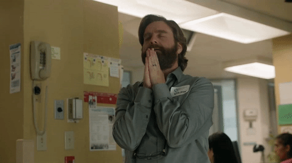
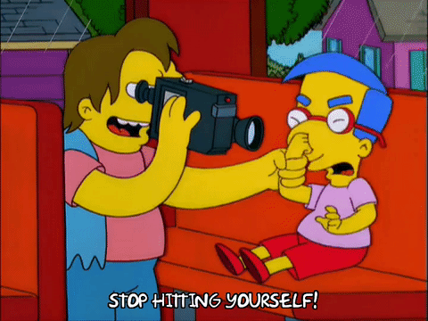

Goal setting is like sex: everyone thinks they’re better at it than they are, and trying harder doesn’t make it any better if the technique is wrong.

I’m just speaking from experience here. I’m the worst offender. I’ve left many a resolution unsatisfied. On multiple occasions I’ve tired out long before a goal was finished. But I can change, and so can you.

If you’re already crushing your goals, and have a system that works for you, great! Save yourself the 10 minutes on reading this and go knock a few things off your to-do list. But if you’ve ever struggled to set goals that matter, or given up on your New Year’s resolutions before the hangover fades on January 1, or gotten frustrated because your dreams are too big and you don’t know where to start, read on.

### Goal Setting for Artists and Dreamers

There’s no shortage of goal-setting, productivity-focused advice out there. A better writer might even say there’s a glut. A lot of it is great in theory, but feels incomplete in practice, especially for people whose goals straddle the line between creative and professional pursuits. If you want to be a lawyer, the trail is well-blazed and accurately mapped. If you want to be an artist, you’re gonna wander in the woods.

I’ll use myself as an example. I’m a writer. I have big dreams: I want to write movies and television. Maybe novels. Or maybe I’ll settle for getting a few claps on a Medium post. Who knows? The point is, I have professional goals centered on creative work. A lot of those goals could be classified as “dreams”. Most of them share a common huge hurdle: the outcome is not entirely in my control.

One of my goals is to become a professional television writer. How do I do that?

It’s too big a thing, and too much of it is reliant on things other people have to do to make it happen. And there’s no single path there. Ask ten TV writers how they made it and you’ll get 13 different answers.

And therein lies the problem. Most people (and articles about goal-setting) treat goals as if they are a stationary target within a clear line of sight and all you have to do is take aim and let fly the arrow of productivity. And if the goal is too far away, break it down into milestones along that well-defined path. And that’s fine, because a lot of stuff that humans try to do works that way. There’s one or two common ways to get there, and you go in that direction until you reach the destination.

That’s not how it works with trying to become a professional writer. Or actor. Or comedian. Or loser of 100 pounds. In all of those cases (and many others), the supposed goal is an amorphous idea of “success” or “making it” that could change at any time and rely more on luck and circumstance and other people than we’d like to admit. Yeah. Even the 100 pound thing.

How many times have you had a goal like “get an agent” or “sell a script” or “get booked on a TV show?” What happens when you don’t do it? If you’re anything like me, it’s a demoralizing road to a few weeks of laying on the couch eating Flamin’ Hot Cheetos and hate watching the _Big Bang Theory_ until you talk yourself off the ledge. All because you’re focused on “goals” that you can’t really control, without a solid plan to even approach them.

A lot of the goal/career management stuff aimed at artists understands this and puts the focus on the work, which is exactly what you have to do, but it usually comes with a side of woo woo that I can’t get on board with. Not all creatives are chill enough to just put things out into the universe and hope it comes back. It’s the right approach for some people, and that’s wonderful, but I’m a little too tightly wound so I’m not trying to do the artist’s version of “let go and let god”.

I know myself. I’m way more _Getting Things Done_ than _The Artist’s Way_ (and I know they aren’t like, competitors, I’m just talking about brainfeel). I need to put things on my calendar and check things off of lists and feel at least a little in charge of my destiny. And I’m not afraid to admit that I’m not out here writing scripts a hundred percent just for the joy of it. I’m trying to build a _professional career_ over here.

So what do we, the Type A, success-minded, go-getter creatives do? We take that too-big, too-out-of-our-control “goal” and work it, reframe it, and put it into a system that allows us to work toward it in a way that’s approachable, flexible, and measurable.

### Enter OKRs

OKR is a goal-setting framework created at Intel in the 70s and later adopted at Silicon Valley darlings like Google and Twitter and Zynga (remember Farmville?) And if you think “OKR” is a scary, nerdy, too-official sounding name, check out what it stands for: _Objectives and Key Results_.

I get it. Sounds gross. But hear me out, because this system is perfect for people like you and me. What do artists and actors and writers have in common with Silicon Valley startups? We all have audacious goals with a low chance of success and no clear path to get there, and we do it anyway.

In the same way that your parents don’t understand how spending, what is it now, five, six grand on an improv class, is going to get you a career, it was equally unclear to just about everyone how a big list of 140 character messages could be a business. It stands to reason that artists could learn from how the tech industry does a few things.

How does this help me, the wannabe television writer who’s coming up on the cusp of a New Year wondering if he can afford to waste another 365 days in pursuit of an elusive thing? Let’s examine the framework.

#### Objectives rather than Goals

The first part of OKRs is the _objective_, and many people use that word interchangeably with _goal,_ but I think there’s a semantic difference that’s important.

In OKRs, the objective should be a call to action. A rallying point. Something that gets you excited, something to align your actions with. It should focus your mission and motivate you.

It doesn’t have to be 100% completable by a certain time, and it doesn’t have to be 100% within your control. It’s just your _objective_, your reason for taking the actions you take.

That’s where the line between _objective_ and _goal_ comes in, for me. A _goal_ is something you shoot for. An _objective_ is less an individual specific result and more a cause. A sports team starts a new season with an objective of being champions at the end of the season. Not winning x games. Winning a certain number of games isn’t exciting, isn’t motivating. Lifting a trophy is.

Winning a championship has some of the hallmarks of a good SMART goal: it’s specific, measurable, theoretically achievable, hopefully relevant (in that it’s meaningful to the organization), and possibly even time based, but it has the additional attribute of being _aspirational_. It can’t be just an idea of something you think you want. It has to _drive_ you.

With that in mind, it’s important that Step One be examining and molding your objectives so that they hit all those criteria. Let’s look at my goal:

> _Become a Professional Television Writer._

In this case, I think this is too broad for my real objectives. When I do the requisite heart and soul searching, I know deep down that I don’t care about writing for a late night show, or sketch comedy, or reality, or any number of other things that would be technically “professional television writing”. I’m scripted narrative or bust. So let’s rewrite this as an objective:

> _Get paid to write scripted television._

Ugh. That’s garbage. Certainly specific and measurable, but there’s no heart in it. It won’t get me going when I question what I’m doing with my life. And it doesn’t really focus my mission. So I gotta keep digging. What do I really want? I want to write the kind of TV that I loved growing up. I want to tell stories that some younger version of me would find so engaging that he’d stay home on Friday nights to watch it like I did with _The X-Files_. I want to tell amazing stories. Now I have my objective:

> _Tell amazing stories on TV._

That feels good. That’s a mission. And the nice thing about this as an objective is that it remains my objective for as long as it is relevant and meaningful to me.

I can’t say for sure that I’m going to be a professional TV writer the next time I sit down to evaluate my goals and progress. So if I’m not, this remains my mission.

But I’m also not going to turn down the opportunity to write for a show that doesn’t meet my criteria for “telling amazing stories”. That’s part of the career path. You don’t always get to write what you want to write, especially when you’re new. You’re going to write what someone else wants you to write to tell their version of amazing stories. Your dream job is still a job, after all.

So even if I hit that original goal of “become a professional”, my mission isn’t over, and I still have this objective to align my next steps.

The exercise is the same in other areas. Take that generic goal, personalize it, and make it your _raison d’être_. At my worst, I felt like I needed to lose 100 pounds (more, if I’m honest, which I am, but only inside the safety of parentheses). But _lose 100 pounds_ isn’t a great goal. Sure, it’s _SMART_, but it’s too big, too focused on a specific number, too easy to become a demotivator rather than a motivator. When I examined it, though, I figured out that it centered around a couple of things that could work as _objectives_. The motivation was that I wanted to be an athlete again, and that became the mission, to compete in athletics. Losing the weight would be a necessary side effect of what I’d have to do to get there — not the goal in and of itself.

It may take some time to figure out what your real objectives are, but it’s work that needs to be done lest you spin your wheels for another year because you haven’t been clear about what you’re really trying to do.

It’s also crucial to see the other side of defining an objective — knowing what _isn’t_ the objective. It’s too easy to try _everything_ because you’re just so thirsty for any taste of success and afraid to miss out on something. And while I think there’s definitely something to that, especially early on, at some point you have to really know what you’re trying to do because you only have so much time in which to try to do it.

This means for me, I’m not going to get distracted by, say, submitting a packet to the Late Night Writers Workshop, because it’s not what I want. I used to. I used to stress myself out writing jokes and desk bits that I hated because “it’s an opportunity”. But, for me anyway, it’s actually not an opportunity. It’s a distraction. The things it would lead to in the absolute best case are not my objective. And because I did the work to define that, I can feel good about not wasting my time on that thing and working on something in line with what I really want to do.

Come up with, at most, 3 or 4 objectives for yourself. Any more than that and you risk diluting focus and sitting down again this time next year wondering why you didn’t make it farther toward any one of them. They could be related or not, but they should all be missions that you can get excited about. These are the areas on which you will focus your actions in the coming weeks, months, and years.

It’s okay if they aren’t all completely in your reach or within your control. In fact, one or two probably should be something slightly out of your grasp, otherwise you’ll stagnate. Be careful, however, not to put too much power in the hands of others. You need a good balance of what you can do through your own work and will, and what you might need a little luck for.

Remember that objectives are specific, measurable, theoretically attainable, and all the other things that make for good goals, but they are also exciting, motivating, and focusing. They are not tasks, nor are they projects. They are the whole which is greater than the parts that will come next.

> **Action**: come up with three well-defined, refined, meaningful objectives that you want to focus on in the coming year.

#### Key Results

Now that you have objectives, how do you measure if you’re making any progress toward them? That’s where the KR comes in.

Key results answer the question “what are the signs that I’m making progress toward the objective?” I say signs, not milestones, because, as you recall, we are not people who get to walk a straight line to the finish and know that a specific number of steps gets us there.

If you’re lost in the woods and your objective is to find civilization, there are ways to increase your odds of getting there — signs you might be headed in the right direction. You might climb a tree or hill to get a better vantage point. Follow the sun or a river. Look for game trails or hiking trails. These early decisions might pay off or might not, but you can at least keep re-evaluating them based on what you learn and eventually find your way out. That’s a lot like trying to pursue an artistic career. You try things based on your knowledge, gain new knowledge, try more things, until hopefully you make it.

And let’s be real here, you could do everything right and still get eaten by a bear before you reach a village. That’s the part out of your control, and you just have to live with that as a reality. I might write a bunch of great scripts and never find that one right person to give them to that becomes the catalyst for my career. But I’m gonna do what I can to increase the chances.

Key results are these things you’re going to keep track of to give yourself that new piece of information that you will use to make the next decision. To get there, we need to answer a few questions.

1.  What are the seeming markers of progress for this objective? For TV writing, those might include getting representation, having a great script win a contest, getting meetings with producers. But don’t just think about the big stuff, because there’s a lot of other pieces too. Making friends with other writers and having a good network. Having new ideas to work on. Experiencing new things so you have something to write about.
2.  Which of those markers are in my control? Getting representation isn’t in your control. If it were, we’d all have great reps. Writing a great script is. Separate the list into two lists, one of things you can control, one of things you can’t.
3.  For the things you can’t control, ask yourself this question: What are the things I can do that would increase my odds of this happening? If you want to get reps, you can do all kinds of things from cold querying to asking your friends who have representation to make an introduction. If you want to get meetings with producers you can research people to contact who make the kinds of things you’re interested in. Gather up all the things you can do to increase the chances of those out-of-your-control items, and toss them into the in-your-control list.

Great. You now have two lists. Things you can directly do, and things that you can’t. That list of things you can’t directly control is important. Hang on to it. It’s your reminder that, while these things may well be the keys to your objective, all you can do is work on stuff that might lead you there, but you’re gonna need a little luck, kismet, grace, or The Secret to cross it off your list. You’re going to do what you can, but ultimately, it’s not up to you. Accepting that will free you up to keep pursuing the hard thing and keep you from getting too discouraged because you’re not quite there _yet_.

You are no longer allowed to beat yourself up for not reaching a goal that you were never fully in charge of.

Take the list of things you can control and try to extract a few measurable behaviors or outcomes. We’re not putting together a task list yet. That’s for later. We want to answer the question:

“If I were watching someone else work toward this objective, what are some of the ways I’d be able to tell they were moving in the right direction?”

Because that’s exactly what you’ll be doing. Evaluating yourself and the progress you’re making.

Sticking with our intrepid TV writing aspirant, if I were observing myself, I’d know I was making progress if I had a portfolio of work that was _great_ and got it in front of some number of people. Or I might know if I’d made progress toward my athletic goal if I completed a 5K or added 100 pounds to my squat or even, yes, lost a certain amount of weight.

The important thing about key results is that they are measurable _results_ of an implied set of tasks, not the tasks themselves. So my KRs are not that I wrote every day or that I worked out five times a week and ate paleo. They are the answer to the question “what would it look like if I did those things?”

Here’s where timing comes in. You’re going to set KRs a quarter at a time, so they should be achievable in three months. Remember, you’re building toward an objective, but you’re not gonna get there all at once. So pick the three or so (again, not too many) KRs that you’re going to focus on in the next quarter, and that’s your gameplan. When you come back in three months, you want to be able to look at these key results and know if you succeeded.

Sticking with the example, I might end up here:

> **_Objective_**_: Tell amazing stories on TV  
> Q1 Key Results:  
> \* Developed three new ideas that I could pitch or write  
> \* Rewrote and polished my pilot script  
> \* Made new connections and communicated regularly with other writers_

We write them in the past tense because what they really add up to is you, three months from now, looking back and saying _“If I were someone trying to achieve x, I would have done a, b, and c.”_

Some of these are strictly quantitative. Some are more binary. The important thing is, in three months time, can I answer yes or no to each of them? I can say if I developed three ideas, and I can say if I polished a script or made new connections, so they all count. It would feel weird to me to say something like _add 4 people to my network_. Some people work that way, and that’s okay, but it’s not me. However, if I went to one party, met a new writer, and never talked to her again, I wouldn’t count it. So even with the more qualitative ones, it’s important to make sure you know how to measure it.

Note that these are not tasks. This is not a to-do list. The implementation is left to you to figure out later. For now, you’re just setting up the parameters.

When next quarter rolls around, you’re going to look at this list, see how you did, and adjust. First, you’ll make sure that your objectives are still your objectives. If they aren’t, change them! Stop chasing things you don’t care about!

If they are, go back to those ideas of what you can and can’t control, and see what you can pull out as key results. Examine how you did on the last set. Do you need to keep going? Are you happy with the results? Should you change course? Doing this every three months gives you enough time to try things and see if they’re moving the needle while not wasting a whole year on something with nothing to show for it.

When you look back on those objectives that aren’t completely in your control, if you set it up right, you can evaluate them based on key results that you _did_ have control of. Ultimately, if you didn’t get an agent this quarter, or sell a script, or book a Broadway show, but you did all the things you thought would put you in a position to have a shot, then you went after your objectives to the best of your ability. No need to wallow; you did what you set out to do and it just didn’t fully pay off. Now it’s about taking those results and figuring out what to do next to try again. Figuring out what you can control, trying it, measuring it, and trying the next thing. Because that’s the whole deal with a creative career. You keep trying, see what does and doesn’t work, then try the next thing.

> **Action**: Come up with two to four meaningful, actionable key results that you can use to measure your progress.

#### Actually Doing It — Day to Day, Week to Week, Month to Month

At this point, you’ve set your OKRs. You have them. The goal setting is complete. You know what you want to do. You know how you’ll measure if you’re doing it. Now we have to answer the question: what do we actually do?

This is where your own system comes in and you’ll have to figure out what works best for you, but it boils down to this:

1.  Every month, examine your OKRs. Make a list of the things you could do that month to make progress in some or all of your KRs. Review last month’s list and either get rid of anything that’s no longer relevant or reschedule anything you didn’t get to but still think will be valuable. This is also a good time to review anything coming up in the next month or two, like submission deadlines or classes, that you might need to plan for. Grade yourself on where you are with your OKRs to this point. Give each KR a percentage measuring how close you are. Your goal is to raise that percentage next month. Focus on what will get you there.
2.  Every week, compile a list of things you need to get done that week for your OKRs. Schedule them, write them down, whatever works for you, but gain an appreciation of what you can do this week to work on your KRs. Review last week. What did you accomplish? What got in your way? Learn from that and adjust. Be realistic. You aren’t helping yourself if you do pie-in-the-sky planning every week and then don’t examine and adjust the next week.
3.  Every day, lay out what you intend to get done. Review the prior day. Reschedule or continue anything you need to. Think about what roadblocks you might have and prepare for them/plan around them. We don’t work in ideal days, we work in real days, and if you lay out a task list with no appreciation for your constraints, you’re just going to feel bad about yourself when you don’t get it done. This applies at all levels.

That’s it. Repeat until forever. Every three months, review those OKRs. The KRs will change almost every quarter. The Os much less often (really only if you achieve one or give up on it).

A system like [Bullet Journal](http://bulletjournal.com/) meshes perfectly with this kind of goal setting, but it can also just be as simple as putting everything on a calendar or to-do list. Everyone is responsible for figuring out how they are most productive.

> **Action**: Every day, plan your tasks according to what will help you move forward on your objectives. Every week, review your previous week and figure out what you need to do in the next one. Every month, evaluate what percentage complete each Key Result is and figure out what you can do in the coming month to raise that percentage. Every quarter, review your OKRs, adjust, and move forward.

The cycle of planning and feedback, quarterly through daily, is important. Planning a whole year in one shot doesn’t work. Setting monolithic “goals” without understanding why or how doesn’t work. Holding yourself hostage over “goals” you can’t control without breaking them down into more realistic actions over which you have some power doesn’t work.

Instead, draw out your true objectives, figure out what you can do to move toward them, and then view everything you’re doing daily, weekly, and monthly through the lens of how it aligns with your objectives. By checking in with yourself and creating that feedback loop, you can plan, make adjustments, celebrate small victories, and keep yourself motivated on the long road to wherever it is you end up.

_Oh and if this helps you get a TV show, please hire me._
