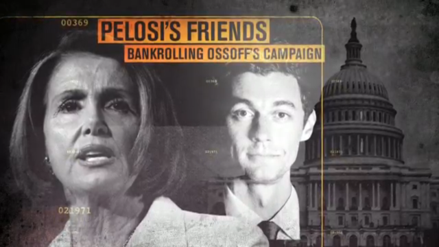

_Originally published on Facebook, added here for shareability._

I was a blue state guy for the last eight years, but have lived in Atlanta for about a year and watched both the 2016 Presidential election and the 2017 special election from right in the heart of red America. Here’s what I can tell you about the race for Georgia’s 6th, and specifically, the campaign the Republicans ran to win it.

In the last six months, I saw hundreds of campaign commercials. On the democrat side, Jon Ossoff/the Democrats appealed to people on issues like women’s health, economic strength, working across the aisle to do what’s good for Georgia, and other reasonable, rational, good messages. When the attack ads from the GOP got worse, Jon would calmly refute, offer facts, and ask people to go to his website and read about his extensive plans and stance on issues ranging from ISIS to budgets.

Before the first part of the runoff I saw I think one commercial that directly took on Trump and it was again, kind of a soft-shoe appeal to decency and intellect — a “surely, now, any rational person can see that we’re going down a dangerous path” message.

I think I saw one “attack” ad about Karen Handel, and it was that she bought expensive office chairs during a budget crisis and owns an expensive car that (maybe?) she got the money for in shady ways but it didn’t really commit to that message.

Meanwhile, on the GOP side, if I hadn’t have been paying attention, I’d have never known who was running, because to them, the right candidate was “not Jon Ossoff”.

The ads from the republican camp, and there were MANY, made me physically ill to watch. Direct, hard-line attacks on Ossoff. There’s one ad that essentially says he’s PRO ISIS, complete with a really effective and scary graphics package of scenes of terrorism and war with random pictures of him superimposed.

Most of the ads featured old rich white people from the rich Atlanta suburbs with a clear, unmasked, unfiltered message of “I think he’s a liar” and “he’s not one of us”, both of which work really well in insular communities like rich white suburbs who are super afraid of losing their rich white power to someone who’s “not one of them”. Doesn’t matter that Ossoff looks like he could be the son of any one of these people, fresh home from Dartmouth, he’s not “one of us”. Xenophobia isn’t always about people from faraway lands, and it’s the bread and butter of the GOP playbook. Always good for solid yards.

There’s one ad that is literally a parody of a Democrat-style ad, very positive, bright colors, not hateful, and the message is that a vote for Jon Ossoff is a vote to make San Francisco proud. It shows all these hipstery/liberal-y “San Franciscans” talking about how great Jon Ossoff is. Again, focusing on the “not one of us” angle, but also, if you’ve spent any time in the south, or in rural America, you know that “San Francisco” is code for “gay” and “hippie” in the same way that “New York” is code for “Jewish”. The message was very clear. If you vote for Democrats you’re voting for hippies and homos and by association Hollywood and not real America.

Then there were the brazen “We need someone who will push through Trump’s agenda and that person could be anyone as long as it’s not Jon Ossoff” ads. They’re not trying to distance themselves from Trump. Not here.

This is the thing the Democrats have to understand. There are a lot of people here and in other red states that have _no inclination_ toward distancing themselves from, or feeling bad about voting for, Donald Trump.

Even Karen Handel’s own ads were focused primarily on how she’s not a Pelosi-loving Democrat. I couldn’t tell you a single one of her positions or opinions apart from “I’m not Jon Ossoff, vote for me” and I saw a lot of her ads.

But she didn’t even have to run that many ads because the NRCC was already going hard in the paint against Ossoff and had been for months. Even during the runoff election, when Republicans were fighting each other for a seat at the table, the NRCC was building up the mythos of Jon Ossoff, ISIS-loving man-child in the pocket of those liberals you all hate so much.

This is the Republican strategy. Play on the fears of their base. Full-out attack on the left. It doesn’t even matter who their candidate is because they’ve transcended the need to actually run a candidate — they need only run against one. Very little of the messaging was even all that specific to Atlanta or Georgia on the whole. While Ossoff was making specific points about his plan to strengthen the growing tech sector in Atlanta, the Republicans were just firing back with “he’s not one of us and look he was kind of a little fruity in this YouTube video from when he was younger.”

In places like Georgia’s 6th, where people already believe what they believe, measured discourse in a 30 second spot isn’t going to swing voters. We have a reality TV host in the White House and substance is no longer a requirement in a campaign ad.

While the left rips itself apart from within, arguing over who is more unassailable on this nuanced issue or that, Republicans are more than happy to flourish under a platform of “just don’t let the liberals take our country” and leave to the imaginations of their constituents what the horrible outcome might be if they do. Everyone gets to have their personal reason for hating liberals and the party ensures they have the votes to push their legislation.

It’s 100% a numbers game. Republicans have figured this out. It’s better to have a person in your party with an imperfect ideology match than to risk the other side getting a foothold. For as much as hardline Republicans might want to make you believe that John McCain is about the closest thing they have to a liberal softie, look at his voting record. It’s as red as the Russia that Sarah Palin imagines when she gazes westward from her front porch.

In this sense, I’m afraid that Republicans might have perfected American Political Strategy in the current climate. While our side cares about the issues that are SO OBVIOUSLY important and right and morally correct, their side is just doing a seat grab at any cost. To borrow a phrase I hate, it’s like we’re playing chess and they’re playing Risk.

The thing you have to know about the people in Georgia’s 6th that voted against Ossoff is that they aren’t on Twitter all day. They aren’t reading thinkpieces. They aren’t super interested in issues that don’t directly affect them day to day, or the nuances of why they should be. They don’t care about the Paris Accord because they’re going to heaven anyway and this isn’t their real home. They’re self-selecting out of being exposed to the kind of information that makes us say “SURELY YOU CAN SEE THAT TRUMP WAS A BAD IDEA AND WE NEED TO FIX THIS IMMEDIATELY”. They don’t see that because they don’t hear the bad news, or if they do hear it, they hear it from Fox News. They’re afraid of ISIS and immigrants and things that challenge their worldview and losing the power they so desperately crave over “real America” and they’re not looking to step out of that bubble.

I’m not sure there is any way to get to them. I hear people say they want to move to Red States to start the groundswell of liberalism but I’m here to tell you it’s just not gonna happen like that because in the year that I’ve lived in Georgia I’ve seen more assault rifles and handguns in my Kroger than I have in 39 previous years of life and they fucking LOVE that they can walk into a grocery store with a military-grade weapon and piss off some liberal snowflakes. And I can tell that they love it because one time they were doing an Insta story about it and laughing and laughing at how they were making people uncomfortable.

And even though Atlanta is a diverse as fuck city with a lot of art and culture, it’s not a big enough city to overtake the VERY red nature of the state as a whole. Even if Atlanta were 100% blue, which it is definitely not, there just aren’t enough here to make the switch. It’s the same in Austin and Miami and any number of liberal cities trapped in proudly red states.

My boots-on-the-ground report is that it fucking SUCKS to be a liberal in one of these places in a time like this. It’s demoralizing. I’ve made dozens of calls to my Republican Senators, but they aren’t listening. How do I know that? Because one of them did a “Not Jon Ossoff” commercial where he just looked at the camera and basically said “Trump is doing great and we need to support him by not electing a liberal”.

I don’t know what to do about this. I hate to be all doom and gloom but our best options might be to just call it a day, see if we can secede the big cities and leave the rest to rot, or hunker down until all the baby boomers die out or get too old to make it to the polling station. Barring that, we’re gonna have to make a pretty hard tactics change, I think, because we can’t keep pretending that voters act on intellect after collecting and analyzing facts.

People respond to fear, not the moral high ground. They respond to what directly affects their lives. Not everyone is like this, but enough are. And Trump being a completely incompetent, unmitigated disaster asshole of a President just doesn’t affect the people in Georgia’s 6th enough for a strategy of “let’s be reasonable here” to work. And for a lot of them, it’s really working in their favor. Because they’d love to take money out of Planned Parenthood and put it in their pockets any chance they get.

Watching this campaign unfold and knowing how it was going to end has been a whole new level of the unending depression that kicked off last November, because I think their strategy is better than ours. Flat out. In the two recent elections that were supposed “Trump referenda”, one went to the guy that literally, physically assaulted freedom of the press, and the other went to “the one that’s not Jon Ossoff”, and I think this is a clear indication that we can’t go into 2018 with the attitude that Trump backlash will carry the day, because these people may not love him, but they hate liberals even more.
